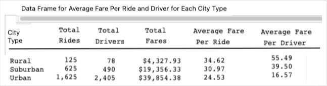
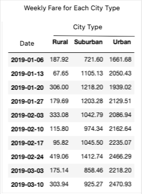
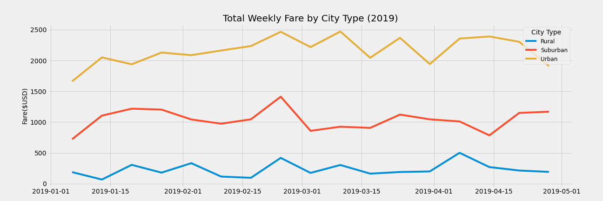

# PyBer_Analysis
## Overview
In this study,two csv documents are merged and analyzed. First document, , contains name of 120 cities, the number of drivers of each city and the type (urban, suburban or rural) of each city. Second document, , contains name of cities, date, fare in each date and ride_id.

In the work, a summary DataFrame of the ride-sharing data by city type is created. Then, using Pandas and Matplotlib, a multiple-line graph that shows the total weekly fares, within the dates 01/01/2019 and 04/28/2019, for each city type is created. 

Finally, based on the findings in the work a written report in which the findings of the study are discussed, how the data differs by city type is summarized and how those differences can be used by decision-makers at PyBer is prepared and presented.

### Purpose

The purpuse of the analysis is to find out how data concerning fare differs by city type and how to use these findings to make decision.

## Results of Analysis and Essential Points of the Code
In the code, the corresponding methods the python librories; pandas, matplotlib and numpy; such as merge, groupby, reset_index, pivot, loc and resample thods are used consonantly. You can find the complete code in the name

.

### Analysis of Average Fare per Ride and Average Fare Per Driver for Each Type of City

First by using groupby method of pandas, total number of rides, total number of drivers, total amaount of fare, the average fare per ride and the average fare per driver for each cyty type are calculated and organized as series. The codes are as follows
> total_rides=pyber_data_df.groupby(["type"]).count()["ride_id"]
> 
> total_drivers=city_data_df.groupby(["type"]).sum()["driver_count"]
> 
> total_amount_of_fares=pyber_data_df.groupby(["type"]).sum()["fare"]
> 
> average_fare_per_ride=total_amount_of_fares/total_rides
> 
> average_fare_per_driver=total_amount_of_fares/total_drivers

and then by using these series, a dataframe is built by the code

> pyyber_summary_df=pd.DataFrame({
> 
>                "Total Rides":total_rides,
>                
>                "Total Drivers":total_drivers,
>                
>                "Total Fares":total_amount_of_fares,
>                
>                "Average Fare Per Ride":average_fare_per_ride,
>                
>                "Average Fare Per Driver":average_fare_per_driver
>                  
> })

The data frame is is formatted by 

> pyber_summary_df["Total Rides"] = pyber_summary_df["Total Rides"].map("{:,}".format)
> 
> pyber_summary_df["Total Drivers"] = pyber_summary_df["Total Drivers"].map("{:,}".format)
> 
> pyber_summary_df["Total Fares"] = pyber_summary_df["Total Fares"].map("${:,.2f}".format)
> 
> pyber_summary_df["Average Fare Per Ride"] = pyber_summary_df["Average Fare Per Ride"].map("{:.2f}".format)
> 
> pyber_summary_df["Average Fare Per Driver"] = pyber_summary_df["Average Fare Per Driver"].map("{:.2f}".format)

The outcome of the data frame can be displayed as follow:

In this table it is clearly seen that altough urban cities has the maximum total number of drivers among these three type of city, they have the minimum average fare per driver. Similarly, urban cities has the maximum total number of rides among these three type of city, they have the minimum average fare per ride.

In fact, average fare per driver in rural cities is more than three times that in urban cities and average fare per driver in suburban cities is approximately 2.5 times that in urban cities. Similarly, average fare per ride in both rural cities and suburban cities is around 1.5 times that of urban cities.

### Analysis of the Total Weekly Fares for Each Type of City

The total weekly fare within the dates 01/01/2019 and 04/28/2019, for each city type is visualized by a multiple line plot.
In order to create a multiple line plot, first the data frame which contains the dates and the corresponding total fare for each city type is built by using the series of codes

> total_fare_for_date=pyber_data_df.groupby(["type","date"]).sum()["fare"]
> 
> total_fare_for_date=total_fare_for_date.reset_index()
> 
> pivot_df_1=total_fare_for_date.pivot(index="date",columns="type",values="fare")
> 
> pivot_df_2=pivot_df_1.loc['2019-01-01':'2019-04-28']
> 
> pivot_df_2.index=pd.to_datetime(pivot_df_2.index)
> 
> citytype_sum_fare_week=pivot_df_2.resample('W').sum()

The output in the top 10 weeks is as the following:

The object-oriented interface method is used to plot line grapgh of fare against time (in week) for each type of city to see their trend visually. This was done in the same coordinate plane to compare the trends in city type. The method is as follows:

> style.use('fivethirtyeight')
> 
> x_labels = ["Rural", "Suburban","Urban"]
> 
> fig, ax = plt.subplots(figsize=(18, 6))
> 
> ax.set_title('Total Weekly Fare by City Type (2019)',fontsize=20)
> 
> ax.set_ylabel('Fare($USD)',fontsize=14)
> 
> ax.plot(citytype_sum_fare_week,label=x_labels)
> 
> ax.set_yticks(np.arange(0, 2550, step=500.0))
> 
> plt.legend()
> 
> lgnd = plt.legend(fontsize="12", mode="Expanded",
> 
>         scatterpoints=1, loc='best', title="City Type")
>         
>         plt.show()  

When we run the codes we will see the following graph:

Acording to the graph, the total weekly fair in rural cities is around $250, the total weekly fare in suburban cities is around $1100 and the total weekly fare in urban cities is around $2200. Amazingly, in the week which starts the day 02/16/2022 total fares rise to the maximum in all of the three city type.

## Summary

The total number of rides in urban cities is 13 times that in rural cities; the ratio of corresponding total fares is not 13 , it is 9.2. However, it is expected that the number of the number of total rides is proportional to the total fares. This explains why the average fare per ride in urban cities is less than that in rural cities.

Similarly, the total number of rides in urban cities is 2.6 times that in suburban cities; the ratio of corresponding total fares is is around 2.1. That is why average fare per ride is 26 % less than that in in suburban cities.

The average fare per driver in rural cities is more than three times that in urban cities and average fare per driver in suburban cities is approximately 2.5 times that in urban cities. Similarly, average fare per ride in both rural cities and suburban cities is around 1.5 times that of urban cities.

Based on these results; the number of drivers in urban cities might be decresed, the number of drivers in suburban cities might also be decresed and the number of drivers in rural cities might be increased.
